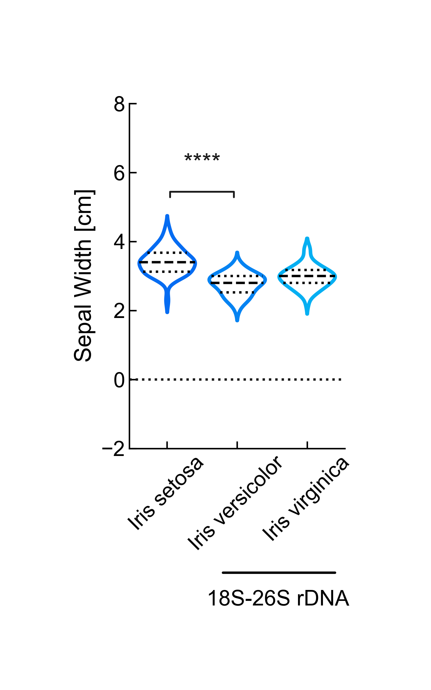

# Violin Plot
Script to generate a violin plot ([Hintze & Nelson, 1998](https://www.tandfonline.com/doi/abs/10.1080/00031305.1998.10480559)). The Iris dataset ([Anderson, 1935](https://wiki.irises.org/pub/Hist/Info1986SIGNA37/SIGNA_37.pdf); [Anderson, 1936](https://doi.org/10.2307/2394164); [Fisher, 1936](https://doi.org/10.1111/j.1469-1809.1936.tb02137.x)) and a custom label depicting Iris inheritance ([Lim et al, 2007](https://doi.org/10.1093/aob/mcm116)) are used for demonstration.

Environment setup:

```bash
conda create -n myenv python=3.11
conda activate myenv
```

Dependencies installation:

```bash
pip install -r requirements.txt
```

Usage:

```bash
python violin_plot.py
```



Cite As

[Nzakimuena, C. B., Solano, M. M., Marcotte-Collard, R., Lesk, M. R., & Costantino, S. (2025). Spatial and temporal changes in choroid morphology associated with long-duration spaceflight. Investigative Ophthalmology & Visual Science, 66(5), 17-17.](https://doi.org/10.1167/iovs.66.5.17)

### References

1. [Hintze, J. L., & Nelson, R. D. (1998). Violin plots: a box plot-density trace synergism. The American Statistician, 52(2), 181-184.](https://www.tandfonline.com/doi/abs/10.1080/00031305.1998.10480559)
1. [Anderson, E. (1935). The irises of the Gaspe Peninsula. Bulletin of American Iris Society, 59, 2-5.](https://wiki.irises.org/pub/Hist/Info1986SIGNA37/SIGNA_37.pdf)
1. [Anderson, E. (1936). The species problem in Iris. Annals of the Missouri Botanical Garden, 23(3), 457-509.](https://doi.org/10.2307/2394164)
1. [Fisher, R. A. (1936). The use of multiple measurements in taxonomic problems. Annals of eugenics, 7(2), 179-188.](https://doi.org/10.1111/j.1469-1809.1936.tb02137.x)
1. [Lim, K. Y., Matyasek, R., Kovarik, A., & Leitch, A. (2007). Parental origin and genome evolution in the allopolyploid Iris versicolor. Annals of Botany, 100(2), 219-224.](https://doi.org/10.1093/aob/mcm116)
